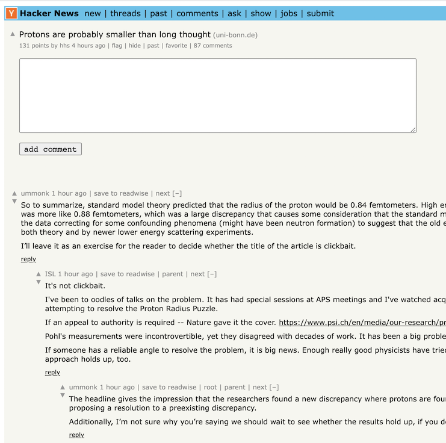
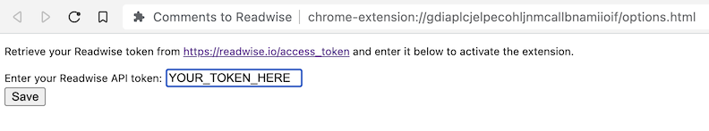

# Comments to Readwise

> [Install from the Chrome Web Store](https://chrome.google.com/webstore/detail/mbpckcijlikkkakedodgpgkdmgbdogmp)



A basic Manifest v3 extension for sending Hacker News and Reddit (old.reddit.com only) comments to Readwise as "tweets"

Ideally I'll support a bunch more sources in future.

Readwise will hopefully just a "comments" category down the line instead of abusing "tweets" but it works for now.

## Setup

Once installed, you need to navigate to the extension settings and configure your Readwise token.

This gets persisted to your Chrome storage so your token should sync across browser instances.



Once your token is saved, you should see the "Save to Readwise" button appear over Hacker News comments

## Development

This plugin uses Vite to build the plugin from Typescript files.

There are only a couple of steps to build a development bundle:

```bash
$ pnpm install # yarn or npm if you prefer, i use pnpm
$ pnpm run dev
```

Once done, you should have a `dist` folder that you can load into Chrome / Chromium browsers as an "Unpacked extension"

## Current issues

At present, the extension only runs on the initial comment page for a submission.

It won't work if you go to the direct link for a comment, such that the original story and author isn't visible on the page.

## Firefox Users

Support for Firefox has been hacked in by building a V3 extension and modifying down to Manifest V2 by hand.

At present, the extension has been submitted to the Firefox Addon Store and is undergoing review.

In the meantime, you can download the `xpi` extension file from [the latest release](https://github.com/marcus-crane/comments-to-readwise/releases)

You can manually load the extension by going to `about:addons`, clicking "Extensions" and then under the cog icon on the right, select "Install Add-on From File..."

With the file picker open, select `comments-to-readwise-<version>.xpi` and you should now have the extension installed.

From there, make sure you select the extension and enter your API token under the Preferences tab in order for it to function.

## Reminder for myself

XPI is created by bundling the extension, replacing with attributes from `manifest-firefox.json` (see `NOTE_FOR_FIREFOX_REVIEWERS.md`) and then signed with [web-ext sign](https://github.com/mozilla/web-ext)